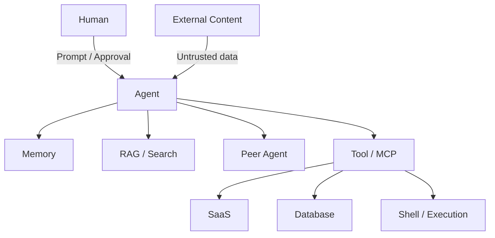

# Agent Trust Boundary Model

YASC uses a reference architecture to make trust crossings explicit.

At each edge, record six security properties:

1. **Identity** — who/what is acting?
2. **Data** — what information crosses the boundary?
3. **Instruction** — can the source influence goals or control flow?
4. **Privilege** — what authority becomes reachable?
5. **Trust** — what validation/provenance applies?
6. **Evidence** — what trace proves the decision and result?

The model is intentionally technology-neutral. A deployment may split or merge components, but any hidden trust crossing should be surfaced in the system-specific boundary map.
